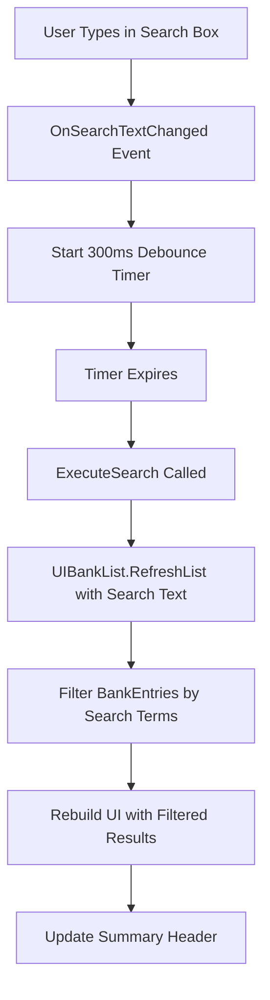

# Bank Organizer - Text Search Feature Architecture

## Executive Summary

This document provides a comprehensive technical specification for implementing a text search feature in the Bank Organizer mod. The search will allow users to filter bank items by name using debounced, multi-term, case-insensitive matching.

## Current Architecture Analysis

### Key Components
- **UIMainPanel.cs**: Contains `_controlsContainer` (lines 116-143) - perfect location for search UI
- **UIBankList.cs**: Has `RefreshList()` method (line 118) that rebuilds the entire item list
- **BankEntry.cs**: Contains `ItemName` property (line 49) that will be searched
- **BankEntry.BuildBankEntries()**: Static method (line 96) that creates sorted bank entries

### Current Data Flow
1. `BankContainerManager` detects changes → triggers `OnBankDataChanged` event
2. `UIBankList.OnBankDataChanged()` → calls `RefreshList()`
3. `RefreshList()` → calls `BankEntry.BuildBankEntries()` → creates sorted list
4. UI elements are created for each `BankEntry` in alphabetical order

## 1. Search UI Component Architecture

### 1.1 Component Placement
**Location**: Inside `_controlsContainer` in `UIMainPanel.cs`
- **Rationale**: The controls container is positioned between title and bank list (line 128: `anchoredPosition = new Vector2(0, -60)`)
- **Integration**: Leverages existing `VerticalLayoutGroup` (lines 135-142) for automatic layout

### 1.2 UI Component Structure
```
ControlsContainer (existing)
├── SearchContainer (new)
    ├── SearchInputField
    ├── SearchPlaceholderText
    └── ClearButton (optional)
```

### 1.3 Unity UI Components
- **InputField**: Primary text input component
- **Text**: Placeholder text ("Search items...")
- **Button**: Optional clear button (X icon)
- **Image**: Background styling to match existing UI

### 1.4 Styling Integration
- **Background Color**: `new Color(0.1f, 0.1f, 0.1f, 0.9f)` (darker than controls container)
- **Text Color**: `Color.white` (consistent with existing UI)
- **Font**: `Resources.GetBuiltinResource<Font>("LegacyRuntime.ttf")` (same as other components)
- **Height**: 30px (consistent with other control elements)

## 2. Search Logic Architecture

### 2.1 Search Algorithm Design
**Multi-term Search Implementation**:
```csharp
public static bool MatchesSearchTerms(string itemName, string[] searchTerms)
{
    if (searchTerms.Length == 0) return true;
    
    string lowerItemName = itemName.ToLowerInvariant();
    
    foreach (string term in searchTerms)
    {
        if (!lowerItemName.Contains(term.ToLowerInvariant()))
        {
            return false; // All terms must match
        }
    }
    return true;
}
```

### 2.2 Search Term Processing
- **Input**: Raw search string from InputField
- **Processing**: 
  1. Trim whitespace
  2. Split by spaces
  3. Remove empty terms
  4. Convert to lowercase for comparison
- **Output**: Array of search terms

### 2.3 Debounced Filtering (300ms)
**Implementation Strategy**:
```csharp
private float _searchDebounceTimer = 0f;
private const float SEARCH_DEBOUNCE_DELAY = 0.3f;
private string _pendingSearchText = "";
private bool _searchPending = false;

// Called every frame in Update()
private void UpdateSearchDebounce()
{
    if (_searchPending)
    {
        _searchDebounceTimer -= Time.deltaTime;
        if (_searchDebounceTimer <= 0f)
        {
            ExecuteSearch(_pendingSearchText);
            _searchPending = false;
        }
    }
}
```

## 3. Integration Strategy

### 3.1 Modified RefreshList() Method
**Current Signature**: `public void RefreshList()`
**New Signature**: `public void RefreshList(string searchText = "")`

**Implementation Strategy**:
1. Keep existing `RefreshList()` for backward compatibility
2. Add overloaded version that accepts search parameters
3. Modify filtering logic within existing entry creation loop

### 3.2 Search Integration Points
- **UIMainPanel.cs**: Add search UI creation in `CreateControlsContainer()`
- **UIBankList.cs**: Modify `RefreshList()` to accept and apply search filters
- **BankEntry.cs**: No modifications needed (search operates on existing `ItemName` property)

### 3.3 Event Handling Architecture
```csharp
// In UIMainPanel.cs
private void OnSearchTextChanged(string newText)
{
    _pendingSearchText = newText;
    _searchDebounceTimer = SEARCH_DEBOUNCE_DELAY;
    _searchPending = true;
}

// In UIBankList.cs  
public void RefreshList(string searchText = "")
{
    // Existing clear logic...
    
    var bankResult = BankEntry.BuildBankEntries();
    var filteredEntries = ApplySearchFilter(bankResult.Entries, searchText);
    
    CreateSummaryHeader(filteredEntries.Count, bankResult.TotalSlots);
    
    foreach (var entry in filteredEntries)
    {
        CreateItemListEntry(entry);
    }
}
```

## 4. Data Flow Design

### 4.1 Search Event Flow


### 4.2 Search Filter Application
```csharp
private List<BankEntry> ApplySearchFilter(List<BankEntry> entries, string searchText)
{
    if (string.IsNullOrWhiteSpace(searchText))
        return entries; // No filter, return all
    
    string[] searchTerms = searchText.Trim()
        .Split(' ', StringSplitOptions.RemoveEmptyEntries);
    
    return entries.Where(entry => 
        MatchesSearchTerms(entry.ItemName, searchTerms)).ToList();
}
```

### 4.3 Summary Header Preservation
- **Current**: Shows total unique items and slots used
- **With Search**: Shows filtered count vs total
- **Format**: `"X of Y Items • Z Slots Used"` (where X = filtered, Y = total)

## 5. Performance Considerations

### 5.1 Optimization Strategies
- **Debouncing**: 300ms delay prevents excessive filtering during typing
- **Early Exit**: Empty search returns immediately without processing
- **Efficient Filtering**: Uses LINQ `Where()` for optimal performance
- **Memory Management**: No additional data structures, filters existing list

### 5.2 Scalability Analysis
- **Current Performance**: Handles hundreds of bank entries efficiently
- **Search Impact**: O(n*m) where n = entries, m = search terms
- **Acceptable Load**: Up to 1000+ entries with multiple search terms

## 6. Edge Case Handling

### 6.1 Search Scenarios
- **Empty Search**: Shows all items (existing behavior)
- **No Results**: Shows empty list with "0 of X Items" header
- **Special Characters**: Handled naturally by string contains
- **Very Long Search**: Debouncing prevents performance issues

### 6.2 UI State Management
- **Search Active**: Clear visual indication of filtered state
- **Search Cleared**: Immediate return to full list
- **Panel Hidden**: Search state preserved for next opening

## 7. Implementation Plan

### 7.1 File Modifications Required

#### UIMainPanel.cs
- **Lines to Modify**: 116-143 (CreateControlsContainer method)
- **New Methods**: 
  - `CreateSearchContainer()`
  - `OnSearchTextChanged(string)`
  - `UpdateSearchDebounce()` (called from existing HandleDragging)
- **New Fields**: Search UI references, debounce timer variables

#### UIBankList.cs  
- **Lines to Modify**: 118-150 (RefreshList method)
- **New Methods**:
  - `RefreshList(string searchText)`
  - `ApplySearchFilter(List<BankEntry>, string)`
  - `MatchesSearchTerms(string, string[])`
- **Modified Methods**: Update `CreateSummaryHeader()` to show filtered counts

#### No Changes Required
- **BankEntry.cs**: Search uses existing `ItemName` property
- **BankOrganizer.cs**: No modifications needed
- **UICanvas.cs**: No modifications needed

### 7.2 Implementation Order
1. **Phase 1**: Add search UI components to UIMainPanel
2. **Phase 2**: Implement debounced event handling
3. **Phase 3**: Modify UIBankList.RefreshList() for filtering
4. **Phase 4**: Add search algorithm and filter logic
5. **Phase 5**: Update summary header for filtered results
6. **Phase 6**: Integration testing and refinement

### 7.3 Risk Mitigation
- **Backward Compatibility**: Keep existing RefreshList() method signature
- **Performance**: Debouncing prevents UI lag during typing
- **Code Isolation**: Search logic contained in discrete methods
- **Rollback Strategy**: Search feature can be disabled by removing UI components

## 8. Testing Strategy

### 8.1 Functional Testing
- **Basic Search**: Single term matching
- **Multi-term Search**: Space-separated terms (all must match)
- **Case Sensitivity**: Verify case-insensitive matching
- **Performance**: Test with large item lists (500+ items)
- **Edge Cases**: Empty search, no results, special characters

### 8.2 Integration Testing
- **UI Responsiveness**: Verify 300ms debounce timing
- **Event Handling**: Search triggers proper list refresh
- **State Persistence**: Search state maintained across panel hide/show
- **Summary Accuracy**: Filtered counts display correctly

## 9. Future Enhancement Opportunities

### 9.1 Potential Extensions
- **Search History**: Dropdown of recent searches
- **Advanced Filters**: By quantity, stack count, or item type
- **Regex Support**: Pattern matching for power users
- **Search Highlighting**: Highlight matching terms in results

### 9.2 UI Improvements
- **Search Icons**: Magnifying glass and clear button
- **Keyboard Shortcuts**: Ctrl+F to focus search box
- **Search Status**: Visual indicator when search is active

## Conclusion

This architecture provides a clean, performant, and maintainable implementation of text search functionality that integrates seamlessly with the existing Bank Organizer codebase. The debounced, multi-term search approach balances user experience with performance, while the modular design ensures easy maintenance and future enhancement.